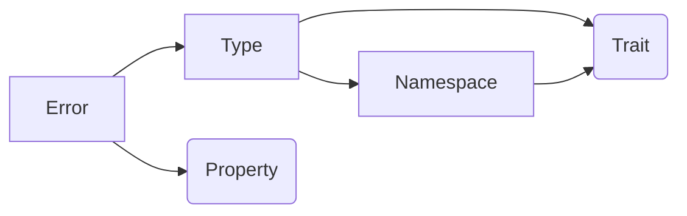
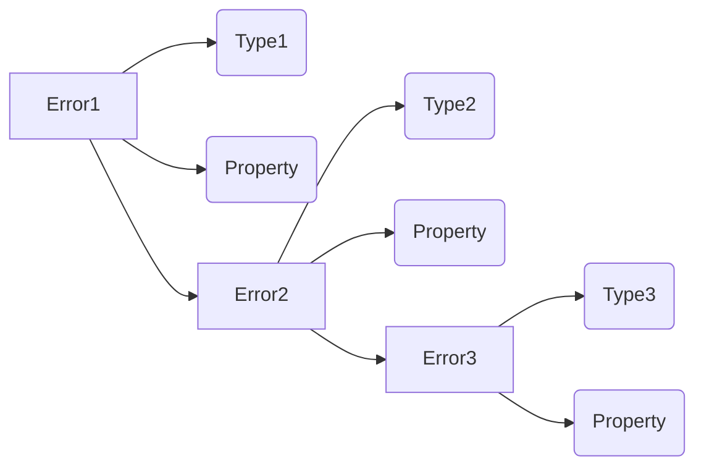
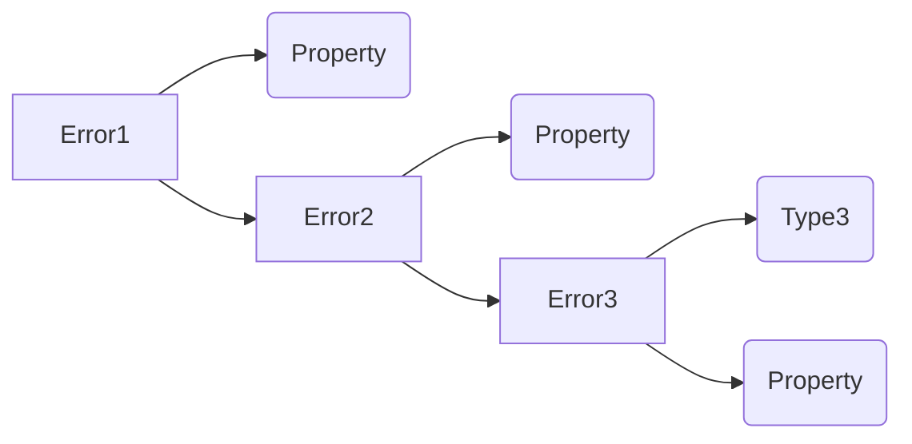

# Error

go的error一直是被人诟病的,对于菜鸡来说无非是每调用一个函数就要判断一下`if err!=nil{return err}`

而对于进阶一点的程序员,则会诟病它的error接口设计的太烂,只要实现了`Error()`,就是一个error,这导致难以比较

直接返回error是一种错误的做法,因为当error被打印出来的时候,你无法知道这个error产生的调用过程,而只会得到一个干巴巴的最终原因

因此,为了方便,我们要实现自己的error系统

## Errorx

这里以[errorx](https://github.com/joomcode/errorx)这个包为例

### Feature

首先看看它的feature

- No extra care should be required for an error to have all the  necessary debug information; it is the opposite that may constitute a  special case
- There must be a way to distinguish one kind of error from another,  as they may imply or require a different handling in user code
- Errors must be composable, and patterns like `if err == io.EOF` defeat that purpose, so they should be avoided // 这里是因为error的判断完全归结为接口类型的判断,这取决于类型和值,即使是对于一样的字符串,也有着不一样的地址,导致不等
- Some context information may be added to the error along the way,  and there must be a way to do so without altering the semantics of the  error
- It must be easy to create an error, add some context to it, check for it
- A kind of error that requires a special treatment by the caller *is* a part of a public API; an excessive amount of such kinds is a code smell

看完之后,我们就大概知道std error的局限在哪里了

在我们自定义的error系统中,我们至少要解决

- error应该是可比较的,这种可比较不应该和它Error()后的label有关(有点kind和type的感觉)
  - error既要有可变的类型type,也要有不变的特性trait
- error应该可以较方便的追加上下文
- error处理应该较快

## Example

```go

var user_namespace_1 = errorx.NewNamespace("user_namespace_1")
var user_trait_1 = errorx.RegisterTrait("user_trait_1")
var user_property_1 = errorx.RegisterProperty("user_property_1")
var user_property_1_p = errorx.RegisterPrintableProperty("user_property_1_p")

func main() {
	err := errorx.AssertionFailed.New("1").WithProperty(user_property_1, "test1").WithProperty(user_property_1_p, "test1_p")
	fmt.Printf("%v\n", err)
	fmt.Printf("typecheck: %t\n", err.IsOfType(errorx.AssertionFailed))
	fmt.Printf("traitcheck: %t\n", err.HasTrait(errorx.Timeout()))
	
	err = errorx.Decorate(err, "2").WithProperty(user_property_1, "test2").WithProperty(user_property_1_p, "test2_p")
	fmt.Printf("%v\n", err)
	err = errorx.IllegalArgument.Wrap(err, "3")
	fmt.Printf("%v\n", err)
	err = errorx.NewType(user_namespace_1, "userErrorType", user_trait_1).Wrap(err, "4")
	fmt.Printf("%v\n", err)
	fmt.Printf("traitcheck: %t\n", err.HasTrait(user_trait_1))
}
```

```go
PS C:\Users\salvare000\Desktop\benchmark\errorx> go run .
common.assertion_failed: 1 {user_property_1_p: test1_p}
typecheck: true
traitcheck: false
2 {user_property_1_p: test2_p}, cause: common.assertion_failed: 1 {user_property_1_p: test1_p}
common.illegal_argument: 3, cause: 2 {user_property_1_p: test2_p}, cause: common.assertion_failed: 1 {user_property_1_p: test1_p}
user_namespace_1.userErrorType: 4, cause: common.illegal_argument: 3, cause: 2 {user_property_1_p: test2_p}, cause: common.assertion_failed: 1 {user_property_1_p: test1_p}
traitcheck: true
```


## 类型系统

- Error
- Namespace
- Type
- Trait
- Property

### 依赖关系



### 类型组织Wrap




### 类型组织Decorate

本质是设置Error的isTraparent = True




### Trait

定义trait,所有的error类型应该都包含一个或多个trait

```go
// Trait is a static characteristic of an error type.
// All errors of a specific type possess exactly the same traits.
// Traits are both defined along with an error and inherited from a supertype and a namespace.
type Trait struct {
	id    uint64
	label string
}
```

内置trait

```go
var (
	traitTemporary = RegisterTrait("temporary")
	traitTimeout   = RegisterTrait("timeout")
	traitNotFound  = RegisterTrait("not_found")
	traitDuplicate = RegisterTrait("duplicate")
)
func newTrait(label string) Trait {
	return Trait{
		id:    nextInternalID(),
		label: label,
	}
}
```

### Type

每个error type都要依托于一个namespace,即error的类型是与领域有关的,我觉得这个设计挺好

使用一个map来表示一个type是否有一个trait(优化也很简单,用一个uint64,但是只支持最多64个traits,但大多数时候够用)

```go
type Type struct {
	namespace Namespace
	parent    *Type
	id        uint64
	fullName  string
	traits    map[Trait]bool
	modifiers modifiers
}
```

常见内置错误类型,注册在"common" namespace下

这些type都没有traits

```go
var (
	// CommonErrors is a namespace for general purpose errors designed for universal use.
	// These errors should typically be used in opaque manner, implying no handing in user code.
	// When handling is required, it is best to use custom error types with both standard and custom traits.
	CommonErrors = NewNamespace("common")

	// IllegalArgument is a type for invalid argument error
	IllegalArgument = CommonErrors.NewType("illegal_argument")
	// IllegalState is a type for invalid state error
	IllegalState = CommonErrors.NewType("illegal_state")
	// IllegalFormat is a type for invalid format error
	IllegalFormat = CommonErrors.NewType("illegal_format")
	// InitializationFailed is a type for initialization error
	InitializationFailed = CommonErrors.NewType("initialization_failed")
	// DataUnavailable is a type for unavailable data error
	DataUnavailable = CommonErrors.NewType("data_unavailable")
	// UnsupportedOperation is a type for unsupported operation error
	UnsupportedOperation = CommonErrors.NewType("unsupported_operation")
	// RejectedOperation is a type for rejected operation error
	RejectedOperation = CommonErrors.NewType("rejected_operation")
	// Interrupted is a type for interruption error
	Interrupted = CommonErrors.NewType("interrupted")
	// AssertionFailed is a type for assertion error
	AssertionFailed = CommonErrors.NewType("assertion_failed")
	// InternalError is a type for internal error
	InternalError = CommonErrors.NewType("internal_error")
	// ExternalError is a type for external error
	ExternalError = CommonErrors.NewType("external_error")
	// ConcurrentUpdate is a type for concurrent update error
	ConcurrentUpdate = CommonErrors.NewType("concurrent_update")
	// TimeoutElapsed is a type for timeout error
	TimeoutElapsed = CommonErrors.NewType("timeout", Timeout())
	// NotImplemented is an error type for lacking implementation
	NotImplemented = UnsupportedOperation.NewSubtype("not_implemented")
	// UnsupportedVersion is a type for unsupported version error
	UnsupportedVersion = UnsupportedOperation.NewSubtype("version")
)
```

### Namespace

```go
// Namespace is a way go group a number of error types together, and each error type belongs to exactly one namespace.
// Namespaces may form hierarchy, with child namespaces inheriting the traits and modifiers of a parent.
// Those modifiers and traits are then passed upon all error types in the namespace.
// In formatting, a dot notation is used, for example:
//
// 		namespace.sub_namespace.type.subtype
//
type Namespace struct {
	parent    *Namespace
	id        uint64
	name      string
	traits    []Trait
	modifiers modifiers
}
```


### Error

Error类似一个链表,每改动一下,都不是在原Error上改动,而是生成一个新的Error,并将原Error作为新Error的cause字段(详见后续的Decorate)

每个Error不仅有自己的Error Type,还有properties,这些properties都说动态的,指的的一些调用者希望传入的键值信息,因为单独的error可能只是表示某种错误,如果想知道现场的值的什么,用这个动态properties(怎么感觉和log很重叠)

```go
type Error struct {
	message    string
	errorType  *Type
    cause  error
	stackTrace *stackTrace
	// properties are used both for public properties inherited through "transparent" wrapping
	// and for some optional per-instance information like "underlying errors"
	properties *propertyMap

	transparent            bool
	hasUnderlying          bool
	printablePropertyCount uint8
}
```

## 行为


### Decorate

decorate只是用于添加一些上下文信息,不会更改Error的`类型`,更不会改变Error的traits和properties

从下面的代码可以看出,即使是Decorate,也是新建了一个Error结构体,并将原err作为自己的cause字段,为了表示自己不是一个真正的Error类型,标识自己是`transparentWrapper`

```go
// 装饰不会改变error的type,traits,properties
func Decorate(err error, message string, args ...interface{}) *Error {
	return NewErrorBuilder(transparentWrapper).
		WithConditionallyFormattedMessage(message, args...).
		WithCause(err).
		Create()
}

func NewErrorBuilder(t *Type) ErrorBuilder
```

### Wrap

如果你想改变Error的type(这导致在与原Error进行type check时失败,有时这的确是我们想要的)

```go
func (t *Type) Wrap(err error, message string, args ...interface{}) *Error {
	return NewErrorBuilder(t).
		WithConditionallyFormattedMessage(message, args...).
		WithCause(err).
		Create()
}
```

### Type Check

判断两个Error是否是同一个类型,或对方是否是自己类型的祖先

```go
// IsOfType is a type check for errors.
// Returns true either if both are of exactly the same type, or if the same is true for one of current type's ancestors.
// For an error that does not have an errorx type, returns false.
func IsOfType(err error, t *Type) bool {
	e := Cast(err)	
	return e != nil && e.IsOfType(t)
}

func Cast(err error) *Error // Cast函数将标准库error接口断言成errorx.Error
```

这个函数单纯的使用for loop跳过透明Error层,即Decorate:

```go
func (e *Error) IsOfType(t *Type) bool {
	cause := e
	for cause != nil {
		if !cause.transparent { 
			return cause.errorType.IsOfType(t)
		}
		cause = Cast(cause.Cause())
	}
	return false
}
```

判断自己是否是对方的类型的继承者(必须在一个namespace内),或自己是否就是对方类型

```go
// Returns true either if both are of exactly the same type, or if the same is true for one of current type's ancestors.
func (t *Type) IsOfType(other *Type) bool {
	current := t
	for current != nil {
		if current.id == other.id {
			return true
		}
		current = current.parent
	}
	return false
}
```

### Trait Check

无他,就是单纯检查type的trait,type祖先的trait,namespace的trait,namespace祖先的trait

## 编码技巧

### builder模式创建error

由于error的参数较多,选择建造者模式来构造error

建造者模式的好处是,我们是对option结构体不断修改,最终build出一个完整的error,这样,只要error出现,就是完好的,而不是一步一步的去设置error的字段

```go
type ErrorBuilder struct {
    message       string
	errorType     *Type
	cause         error
	mode          callStackBuildMode
	isTransparent bool
}
```

#### 使用链式调用来set字段

```go
func (eb ErrorBuilder) WithCause(err error) ErrorBuilder
func (eb ErrorBuilder) Transparent() ErrorBuilder
func (eb ErrorBuilder) EnhanceStackTrace() ErrorBuilder
func (eb ErrorBuilder) WithConditionallyFormattedMessage(fmt string, args ...interface{}) ErrorBuilder
```


## 打印特性

### 实现fmt.Printf()接口

```go
func (e *Error) Format(s fmt.State, verb rune) {
	message := e.fullMessage()
	switch verb {
	case 'v':
		io.WriteString(s, message)
		if s.Flag('+') {
			e.stackTrace.Format(s, verb)
		}
	case 's':
		io.WriteString(s, message)
	}
}
```

## 运行时静态断言

以这样的方式明确指出,

*Error类型满足fmt.Formatter接口...

```go
var _ fmt.Formatter = (*Error)(nil)
var _ encoding.TextMarshaler = (*Type)(nil)
```

## 设计缺陷与思考

### Namespace与Type

个人感觉,完全没必要设置这个Namespace作为一个单独的结构体,但是Namespace作为逻辑上的一个域,是有必要的,但实现时,完全可以就直接只使用Type,因为目前来看,它的结构体字段上,二者是相似的,几乎无差.

从逻辑的角度看,type不断继承,需要一个baseType,和type在一个namespace下,都说说的通的,所以,baseType和namespace,几乎是可以不加区分的

再不济

```go
type Namespace Type
```

