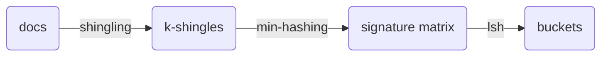

# locality sensitive hashing

位置敏感哈希,这是一种hash算法,当两个对象被hash到同一个桶中时,我们认为这两个对象是可能相似的,然后去检查这两个对象的相似性,最后得出答案,这避免了对所有对象两两之间进行O(N^2)的比较

## 寻找相似的文章

## shingling

shingling是一个取样过程,最终得到k-shingle的集合,即每个shingle含有k个token,token可以是char,word等,一般可以用word

shingle的方法是,维护一个k大小的窗口,从文档开头开始,取样,然后向后移动一个token,继续取样,重复上述过程

假设doc是"abcab",以k=2,token=char来shingle,则得到{ab,bc,ca,ab} -> {ab,bc,ca}(忽略重复的)

假设doc是"a rose is a rose is a rose",以k=4,token=word来shingle,则得到{ (a,rose,is,a), (rose,is,a,rose), (is,a,rose,is),(a,rose,is,a),(rose ,is ,a ,rose) } -> { (a,rose,is,a), (rose,is,a,rose), (is,a,rose,is) }

现在我们有了两个doc的k-shingle集合,一种朴素的想法是直接计算这两个集合的jaccard相似度即可,这需要O(N^2)的复杂度

## min-hashing

在保留相似性的情况下,将大的shingle的集合hash成小的signature

- if sim(C1,C2) is high, then with high prob. h(C1) = h(C2)

- if sim(C1,C2) is low, then with high prob. h(C1) ≠ h(C2)

> Pr[ *h*min(*A*) = *h*min(*B*) ] = *J*(*A*,*B*)

不是所有的相似性度量都能找到何时的hash函数,但是当使用jaccard时,min-hashing就是一个合适的hash函数

首先我们在shingling可以得到一个shingles矩阵(行是shingle,列是doc),我们定义一次min-Hashing是这样的,首先生成一个随机的全排列,然后将每一列按这个全排列进行重新排列,然后寻找第一个为1的行号,这个行号就是minHashing的结果(至于这个行号是选择映射后的还是映射前的,其实无所谓)

进行多次minHashing,我们得到了一个signature matrix,每一行就是相应的列的一次minHashing的结果

比如一列是(1100011),排列向量是(2376154),那么结果是(0111100),排列向量代表着映射后的位置

> 一般可能hash100次,即最终的signature矩阵有100行

## LSH

我们认为两个doc之间如果jaccard的相似度大于0.8,就是相似的

LSH哈希函数的目的是将一些doc映射到一个桶中,我们认为一个桶内的doc就是可能相似的备选对(candidate pair),然后去check这些备选对即可

在lsh中,一列被分为b个band,一个band包含r行,我们每次对一个band进行hash(一列hash到一个桶,并且只有当band完全相同时,才会hash到一个桶),对于hash到一个桶内的不同列,我们认为其是备选对,check它们真正的相似性

继续hash下一个band,重复操作

> 因此,对于hash到一个桶内的不同列,它们至少是有一个band是完全相同的,假设sim(c1,c2)=0.8,也就是c1,c2两列的相似度为0.8,也就是每个signature相似的概率为0.8,那么一个band完全相同的概率为(0.8)^r

> 这个hash函数的选取,只需要保证,必须是完全相同才能映射到一个桶中