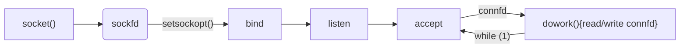
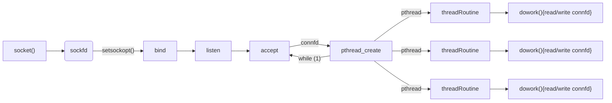
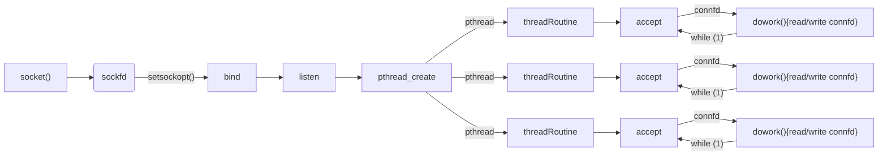
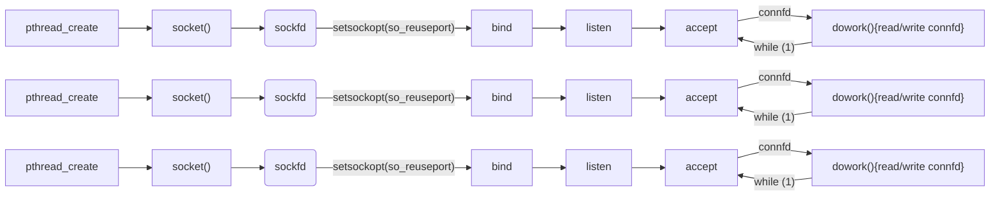
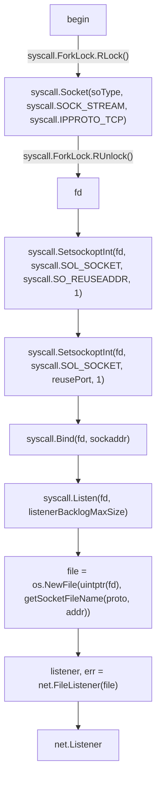

# 高性能linux服务器


## 服务器监听范式

一个传统的单线程服务器



一个传统的多线程服务器, pthread也可以换成fork,多进程



一个传统的多线程服务器,多线程同时accpet同一个sockfd

> 这种方法应该会触发所谓的__"惊群现象"__,在linux2.6后,如果是多进程调用sockfd.accept(),则惊群被解决
>
> 如果是使用epoll_wait()监听sockfd,则仍然存在惊群问题,其原因很明显,因为只是在监听文件描述符,内核没权利指定到底哪个线程epoll_wait成功,而accept()解决惊群则是因为将accept设计成了某种意义上的原子指令
>
> 解决方法是对多个线程,任何时刻都只让一个线程去epoll_wait sockfd



一个现代的多线程服务器,使用了SO_REUSEPORT来达到多个普通的sockfd绑定到同一个port,这样的好处是内核帮你实现了负载均衡,由于是不同的sockfd,所以即使使用epoll_wait,也只会有一个sockfd被唤醒




## SO_REUSEPORT&SO_REUSEADDR

`SO_REUSEADDR` 常见的是用于复用监听TIME_WAIT状态的端口,对于多线程监听同一个端口,也需要使用这个参数

`SO_REUSEPORT`

为了解决上述的常见的多线程处理网络请求的需求,linux推出了一个sockopt参数: 

首先给出官方文档的介绍,很清晰了

> SO_REUSEPORT (since Linux 3.9)
>
> Permits multiple AF_INET or AF_INET6 sockets to be bound
>               to an identical socket address.  This option must be set
>               on each socket (including the first socket) prior to
>               calling bind(2) on the socket.  To prevent port hijacking,
>               all of the processes binding to the same address must have
>               the same effective UID.  This option can be employed with
>               both TCP and UDP sockets.
>
> For TCP sockets, this option allows accept(2) load
>           distribution in a multi-threaded server to be improved by
>           using a distinct listener socket for each thread.  This
>           provides improved load distribution as compared to
>           traditional techniques such using a single accept(2)ing
>           thread that distributes connections, or having multiple
>           threads that compete to accept(2) from the same socket.
>
> For UDP sockets, the use of this option can provide better
>       distribution of incoming datagrams to multiple processes
>       (or threads) as compared to the traditional technique of
>       having multiple processes compete to receive datagrams on
>       the same socket.

在go中如何实现呢?我们知道一般提供的都是linux c的api,对于go,当然可以通过syscall,但还是会有些不同

具体可以看看这个repo: https://github.com/kavu/go_reuseport/blob/47bb7f1bfa3921a92422a1eb4f0941e9caed1103/tcp.go#L96

如何完成syscall得到的fd与go语言内置的net.Listener之间的转换,可能是一个关键

在该库中,是这样实现

> 由于SO_REUSEPORT在go中尚未提供,所有直接用 var reusePort = 0x0F 代替



这里

- `getSocketFileName()`
  - 只是单纯的返回了`fmt.Sprintf("reuseport.%d.%s.%s", os.Getpid(), proto, addr)`
- `os.NewFile(fd uintptr, name string)*os.File`
  - returns a new File with the given file descriptor and name.`	

- `net.FileListener(* os.File)`
  - `FileListener returns a copy of the network listener corresponding to the open file f`

- `listenerBacklogMaxSize`
  - `fd, err := os.Open("/proc/sys/net/core/somaxconn") 默认最大128`

### 非阻塞io

文件描述符应该被设置成非阻塞,如果你通过epoll等进行io复用,可以通过fcntl设置

`fcntl(fd, F_SETFL, O_NONBLOCK);`

## 高级封装

import "golang.org/x/sys/unix"

直接使用syscall可能比较复杂繁琐,golang.org实现了一个类似c语言的封装,api和c语言的接口基本一致

```go
unix.Socket(domain int, typ int, proto int)
unix.SetsockoptInt(fd int, level int, opt int, value int)
unix.Bind(fd int, sa unix.Sockaddr)
unix.Listen(s int, n int)
unix.Accept(fd int)
```

我们之前说过将fd转换到net.Listener的方法,这里也同样适用


## 减少内核态切换拷贝开销

如果是UDP类型通信,每调用一次recvmsg,都会触发内核态缓冲区到用户态缓冲区的数据拷贝,并且只会拷贝一个数据包,为了减少次数,我们期望一次接受多个UDP包,linux提供了recvmmsg,即recv multiple msg, 一次性接受多个包.

go中可以自己封装syscall(这里的6,指的是后面的参数个数)

```go
func (rw *ReaderWriter) read() (int, error) {
 	n, _, err := unix.Syscall6(unix.SYS_RECVMMSG, uintptr(rw.fd),uintptr(unsafe.Pointer(&rw.msgs[0])), uintptr(len(rw.msgs)), unix.MSG_WAITFORONE, 0, 0)
    return int(n),err
}
```

